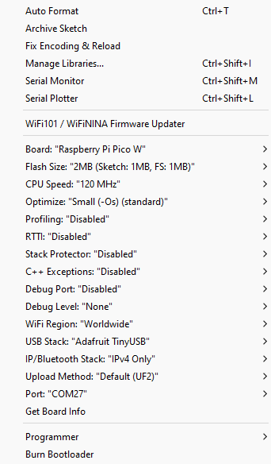

<h2 align="center"> PicoLogger Hardware USB Keylogger and Bad-USB</h2>


<h3>Project Synopsis</h3>
A hardware USB keylogger, Bad-USB device, Virtual Keyboard, and Remote WiFi Shell for $10 using the Pi Pico, Pi Pico W, Pi Pico 2, &amp; Pi Pico 2 W!

<h3>Features Overview</h3>

- Flash, plug and play
- Bad-USB Functionality using Duckyscript
- Virtual 'in browser' keyboard (Pico W &amp; Pico 2 W only)
- Hidden Remote Shell for Windows and Linux (Pico W &amp; Pico 2 W only)
- Remote screenshots for Windows (Pico W &amp; Pico 2 W only)
- Webserver to display results, payload management and more. (Pico W &amp; Pico 2 W only)
- Multi keypress handling for key combinations
- WiFi ON/OFF serial control (Pico W &amp; Pico 2 W only)
- Run Bad-USB payloads on boot
- Create, run, edit and delete Bad-USB payloads (Pico W &amp; Pico 2 W only)
- Change wifi settings and others
- Optional screen + nav-switch and USB-male port mods.
- USB mouse support (for keyboard/mouse combo functionality)
- Sudo Password sniffer
- Keyboard layout switching (Pico W &amp; Pico 2 W only)

<h3>Component List</h3>

1. A Raspberry Pi Pico, Pico W, Pi Pico 2, or Pi Pico 2 W
2. USB-A female port
3. Thin gauge wire (22awg solid copper core wire is good)
4. A glue gun to secure components (for 3D printed case)
5. USB-A Male port (optional mod)
6. SD1306 OLED screen 128x32px (optional mod)
7. 5-Way Thru-Hole Nav Switch `SKRHADE010` *small* or `ADA504` *large* (optional mod)

<h3>Setup (easy method)</h3>

1. Hold down the `BOOTSEL` button on your Pico or Pico W
1. Connect your Pico or Pico W to your computer via USB
2. A new drive named something like `RPI-UF2` or `RP2350` should appear
3. Copy the .uf2 file from the `UF2` folder for your specific Pico to the `RPI-UF2` drive (*use OLED verion if you are using the screen mod*)
4. The Pico should now restart as a picologger!

<h3>Setup (from source)</h3>

1. Download Arduino 1.8.x (Legacy Version)
2. Goto File > Preferences > then add this line to Additional Boards Manager URLs :
```
 https://github.com/earlephilhower/arduino-pico/releases/download/global/package_rp2040_index.json
```
3. Goto Tools > Board > Boards Manager > then search and install Raspberry Pi Pico/RP2040/RP2350
4. Goto Sketch > Include Library > Add ZIP Library > then add the files from `librares` folder
   - [libraries/Pico-PIO-USB-0.6.1.zip](libraries/Pico-PIO-USB-0.6.1.zip)
   - [libraries/HIDKeyboard.zip](libraries/HIDKeyboard.zip) \[Deprecated\] (No longer required PicoLogger-v2.0 and above)
5. (For Screen mod ONLY) - Goto Tools > Manage Libraries > then search for Adafruit_SSD1306 and click install.
6. Goto Tools > then change all options below

*Options for Pico and Pico W*  


*Options for Pico 2 and Pico 2 W*  


7. Once you have the correct options selected, upload the sketch to your Pico.

<h3>Wiring Diagrams</h3>

Although PicoLogger works fine without any of these additions, a USB-A female port is needed for keylogging functionality.


**Wiring for USB Female Connector** 
- To use the keylogging functionality, wire a female USB port to host a keyboard.

```
Pico/Pico-W  ||    USB-A Port

GND          =>    GND (PIN 1)

GPIO 19      =>    D+ (PIN 2)

GPIO 20      =>    D- (PIN 3)

VCC          =>    5v (PIN 4)
```

<h3>Optional Mods</h3>

**Wiring for SD1306 OLED screen**
- If you are using PicoLogger-OLED, you will need to wire a screen and nav switch (wiring and pinout images are in [/Images](Images))
```
Pico/Pico-W  ||    SD1306 128x32 

GND          =>    GND

GPIO 4       =>    SDA

GPIO 5       =>    SCL

3v3          =>    VCC
```

**Wiring for 5-Way Thru-Hole Nav Switch**

- the smaller button `SKRHADE010` is recomended for space constraints inside a case. 
```
Pico/Pico-W  ||    5-Way Nav Switch

GND          =>    GND

GPIO 6       =>    PIN 1 (Up)

GPIO 7       =>    PIN 2 (Down)

GPIO 8       =>    PIN 3 (Left)

GPIO 9       =>    PIN 4 (Right)

GPIO 10      =>    PIN 5 (Center)

```


**Wiring for USB Male Connector**
- If you don't want to use the Pi's built in Micro-USB, you can use the test pads on the back of the Pico to attach a USB male connector.

```
Pico/Pico-W  ||    USB-A Port

TP1          =>    GND (PIN 1)

TP3          =>    D+ (PIN 2)

TP2          =>    D- (PIN 3)

VCC          =>    5v (PIN 4)
```


<h3>Usage</h3>

1. Serial Control
   Using a serial monitor like Putty or alike, 
   Choose your COM port for your Pico and use 115200 baudrate
   - `read`                   : Output logged keys to serial
   - `clear`                  : Delete all logs
   - `format`                 : Format file system (LittleFS)
   - `wifion`                 : Enable WiFi AP (Pico W &amp; Pico 2 W only)
   - `wifioff`                : Disable WiFi AP (Pico W &amp; Pico 2 W only)
   - `ssid <yourssid>`        : Change the SSID (requires restart)
   - `password <newpassword>` : Change the password (requires restart)
   - `pobenabled`             : Enable payload on boot (non-wifi version only)
   - `pobdisabled`            : Disable payload on boot (non-wifi version only)
     
     *(All logs, WiFi state & settings will be saved to survive restarts and reflashing - use `format` command to reset defaults & remove ALL files)*
3. Web Interface (Pico W &amp; Pico 2 W only)
   - Connect to the WiFi network - (Default SSID > `PicoLogger` PASSWORD > `12345678`)
   - Goto `http://192.168.42.1` to view logs, manage payloads and change settings etc.


<h3>Functions</h3>

**USB Keylogger**

Place in between a keyboard and host system (PicoLogger is powered by the host).
All keystrokes from that keyboard will be collected in a log file that can be read over serial (all Pico's), or over the webserver (Pico W &amp; Pico 2 W only).


**Bad-USB Functionality**

The Pi Pico (non-W) can be setup to run a pre-coded payload on boot using the command `pobenabled`. 
You will need to flash the pico after editing the `payload()` function in the PicoLogger.ino file.
An example payload is provided to show some basic functionality using this (non-W) version

```
void payload() {
  // Example Payload - modify this as needed.
  delay(2000);
  // key press
  Keyboard.press(KEY_LEFT_GUI);
  Keyboard.press('r');
  delay(100);
  // keys release (for multi keypresses)
  Keyboard.releaseAll();
  delay(1500);
  // print string
  Keyboard.print("notepad");
  delay(1000);
  Keyboard.press(KEY_RETURN);
  delay(100);
  Keyboard.releaseAll();
  delay(3000);
  // print string + return
  Keyboard.println("Hello World!");
}
```

With the Pico W you can use the 'Payload Manager' webpage to create, run, edit and delete payloads as well as enable any payload on boot.
The Pico W version has it's own handler so you can use basic Duckyscript commands to create Bad-USB scripts in the editor.

*example "hello world!" duckyscript*
```
REM Example Script
DELAY 1000
REM press Windows key + R key
GUI r
DELAY 500
REM Type a string of text
STRING notepad
REM press enter
ENTER
DELAY 3000
STRING hello world!
```

*example rickroll duckyscript*
```
REM rickroll!

REM delay 750ms before running to make sure everything is connected
DELAY 750

REM GUI r holds down the "windows" key and R at the same time, opening the run box
GUI r

REM Delay for 500ms (half a second)
DELAY 500

REM type in the rickroll youtube link
STRING https://www.youtube.com/watch?v=dQw4w9WgXcQ

DELAY 500

REM press the enter key
ENTER
```


**Virtual Keyboard** (Pico W &amp; Pico 2 W only)

With the Pico W &amp; Pico 2 W you can use the Virtual Keyboard webpage to send keystrokes to the host! 
CTRL, ALT, GUI and SHIFT can be toggled for key combinations.


**Windows Remote Shell** (Pico W &amp; Pico 2 W only)

Navigate to the `Remote Shell` page. 
1. Click `Deploy Windows Agent` while connected to a Windows host.
2. Wait 10 - 20 seconds for the agent to start on the host (the Powershell script for this can be found in `Scripts` folder. [Remote-Shell-Agent.ps1](Scripts/Remote-Shell-Agent.ps1)
3. Use the command input to send Powershell commands to the host and receive output.

**Linux Remote Shell** (Pico W &amp; Pico 2 W only)

The Linux agent requires a sudo password - if it has not been automatically sniffed (see sudo pass sniffing below), it can be specified in the password box.
1. Click `Deploy Linux Agent` while connected to a Linux host.
2. Wait 10 - 20 seconds for the agent to start on the host (the Bash script for this can be found in `Scripts` folder. [Remote-Shell-Agent.sh](Scripts/Remote-Shell-Agent.sh)
3. Use the command input to send Bash commands to the host and receive output.


**Remote Screenshots** (Pico W &amp; Pico 2 W only)

For Windows systems you can use the `Screenshots` page. 
1. Click `Deploy Agent` while connected to a Windows host.
2. Wait 10 - 20 seconds for the agent to start on the host (the Powershell script for this can be found in `Scripts` folder. [Remote-Screenshot-Agent.ps1](Scripts/Remote-Screenshot-Agent.ps1)
3. Use the 'Take Screenshot' button to receive screenshots of the host display.


**Sudo Password Sniffing**

PicoLogger has an automatic password sniffer - it works by listening for any sudo command, and assumes the next line will be the password in between enter keypresses.
if the password has already been found the sniffer will be deactivated until Picologger has been powered off or restarted.

**Keyboard Layout Selection**

On both the web UI and screen UI, you can now select the keyboard layout for using Bad-USB, Remote Shell, and Remote Screenshot functions. 
This changes the selected layout without needing to reboot PicoLogger!


**File Explorer** (Pico W &amp; Pico 2 W only)

Navigate to the `File Explorer` page. 
This allows you to download, edit, and delete all files on the file system.


**OLED User Interface** (Pico W &amp; Pico 2 W only)

Using an SD1306 128x32 screen and 5-way nav-switch, you can control PicoLogger on-device using the PicoLogger UI!


<h3>TO-DO</h3>

2. Change Hardware ID etc (settings)
3. Virtual Keyboard special character handling
4. Virtual Keyboard arrow keys and others
